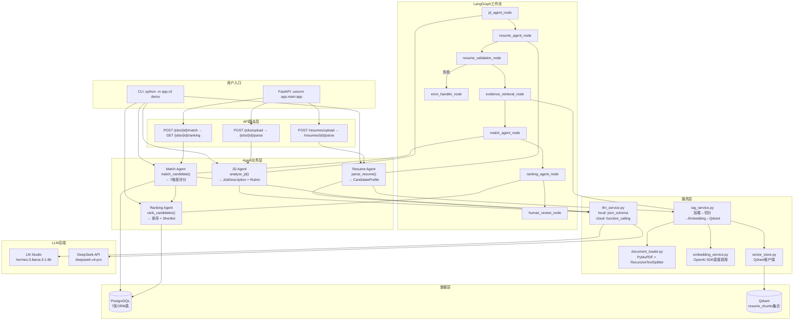

# 核心 Pipeline 实现 — 2026-05-31

## 本次改动概述

完成 HireFlow Phase 1.1 核心筛选流程的全部代码实现。从零到可运行的端到端 Demo：JD 解析 → 简历解析 → 匹配评分 → 排序 → 结果展示。

## 系统流程图



## 详细改动列表

### 数据库层 (3个文件)
| 文件 | 内容 |
|---|---|
| `app/database/models.py` | 7个ORM表: Job/Candidate/ResumeChunk/MatchResult/InterviewQuestion/InterviewEvaluation/EmailDraft |
| `app/database/crud.py` | 完整CRUD: create_job/get_job/update_job_profile, create_candidate/get_candidate/update_candidate_profile, save_resume_chunks, save_match_result/get_match_results_by_job |
| `app/database/session.py` | init_db()自动建表 + get_db() FastAPI依赖注入 |

### Agent 实现 (4个文件)
| 文件 | 功能 | 关键方法 |
|---|---|---|
| `app/agents/jd_agent.py` | 岗位解析 | `analyze_jd()`: 第1步LLM提取→JobDescription, 第2步生成Rubric |
| `app/agents/resume_agent.py` | 简历解析 | `parse_resume()`: LLM提取→CandidateProfile (含嵌套Education/Project/WorkExperience) |
| `app/agents/match_agent.py` | 匹配评分 | `match_candidate()`: 7维度评分, `_build_match_prompt()`: 构造对比提示词 |
| `app/agents/ranking_agent.py` | 排序 | `rank_candidates()`: 代码排序+LLM生成解释, `_generate_explanation()` |

### RAG 服务 (1个文件)
| 文件 | 功能 |
|---|---|
| `app/services/rag_service.py` | `index_resume()`: 加载→切分→Embedding→Qdrant; `search_evidence()`: 按candidate_id过滤检索; `search_evidence_for_match()`: 自动从JD构建查询 |

### LangGraph 节点 (1个文件)
| 文件 | 内容 |
|---|---|
| `app/graph/nodes.py` | 8个节点真实实现: jd_agent/resume_agent/resume_validation/evidence_retrieval/match_agent/ranking_agent/human_review/error_handler |

### API 路由 (3个文件)
| 文件 | 端点 |
|---|---|
| `app/api/jobs.py` | POST /jobs/upload, POST /jobs/{id}/parse, GET /jobs/{id}, GET /jobs/ |
| `app/api/resumes.py` | POST /resumes/upload, POST /resumes/{id}/parse, GET /resumes/{id}, GET /resumes/ |
| `app/api/matching.py` | POST /jobs/{id}/match, GET /jobs/{id}/ranking, GET /jobs/{id}/candidates/{id}/detail |

### CLI Demo (1个文件)
| 文件 | 功能 |
|---|---|
| `app/cli.py` | `python -m app.cli demo` 运行完整示例 (1JD+3简历) |

### 入口文件
| 文件 | 改动 |
|---|---|
| `app/main.py` | FastAPI lifespan管理 + init_db() + CORS + 注册3个路由模块 |
| `app/utils/config.py` | Pydantic Settings + `extra="ignore"` 修复 |

## 端到端测试结果

**测试环境:** LM Studio (hermes-3-llama-3.1-8b) + PostgreSQL + Qdrant

**测试岗位:** 初级 AI 应用开发工程师

| 排名 | 候选人 | 总分 | 等级 | 关键优势 |
|---|---|---|---|---|
| 1 | 李明 | 84 | Strong Match | 有 LangChain/RAG 项目经验, AI硕士 |
| 2 | 张伟 | 82 | Strong Match | 数据科学硕士, 有简历筛选系统项目 |
| 3 | 王芳 | 70 | Medium Match | Java后端经验, 但缺少 AI 相关技能 |

评分结果符合预期: 有 AI 项目经验的候选人排在前列，纯 Java 开发者排名靠后。

## 当前项目状态

```
HireFlowAgents/
├── app/
│   ├── main.py              ✅ FastAPI 入口 + init_db
│   ├── cli.py               ✅ CLI Demo 工具
│   ├── api/                 ✅ 3个路由模块 (jobs/resumes/matching)
│   ├── agents/              ✅ 4个Agent实现 (jd/resume/match/ranking)
│   ├── graph/               ✅ LangGraph (state/nodes/workflow)
│   ├── schemas/             ✅ Pydantic数据模型
│   ├── services/            ✅ 5个服务 (llm/embedding/vector/document/rag)
│   ├── database/            ✅ PostgreSQL (models/session/crud)
│   └── utils/               ✅ config + logger
├── docker-compose.yml       ✅ PostgreSQL + Qdrant + API
├── requirements.txt         ✅ 57个Python依赖
└── logs/                    ✅ 项目计划+技术选型+开发日志
```

## 下一步计划

- **Phase 1.2**: interview_agent / evaluation_agent / email_agent 实现
- **Phase 1.2**: 前端页面搭建 (Next.js + Tailwind CSS)
- **Phase 1.3**: RAG 证据在匹配评分中实际使用
- **Phase 1.3**: Qdrant 存储集成测试
