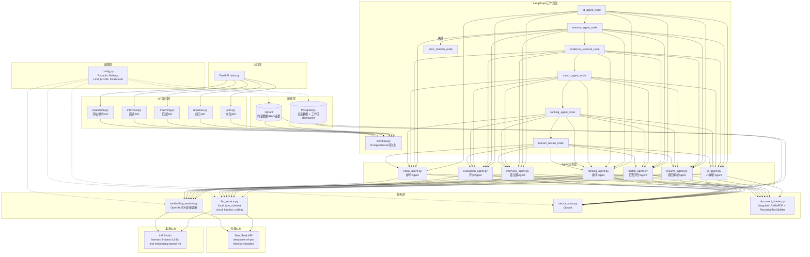

# 框架搭建 — 2026-05-31

## 本次改动概述

HireFlow 项目初始化，完成从零到可运行框架的搭建。包括：
- 项目文件结构创建 (40+ 源文件)
- 技术栈选型并落地 (PostgreSQL + Qdrant + 双模式 LLM)
- LM Studio 本地模型集成测试通过
- DeepSeek 云端 API 集成测试通过
- 协作规则建立 (Git 安全网、中文注释、Dev Logs)

## 系统流程图



## 详细改动列表

### 第一阶段: 项目初始化
| 文件 | 改动 |
|---|---|
| `app/main.py` | FastAPI 入口，根路径健康检查 |
| `app/graph/state.py` | `HiringState` TypedDict，12 个共享状态字段 |
| `app/graph/nodes.py` | 14 个工作流节点函数 (含 error_handler) |
| `app/graph/workflow.py` | StateGraph 构建 + PostgresSaver + 条件路由 |
| `app/schemas/*.py` | 4 个 Pydantic schema 文件 (JD/Resume/Match/Evaluation) |
| `app/agents/*.py` | 7 个 Agent 实现框架 (jd/resume/match/ranking/interview/evaluation/email) |
| `app/api/*.py` | 5 个 FastAPI 路由模块 |
| `app/services/*.py` | 4 个基础服务 (llm/embedding/vector/document) |
| `app/database/*.py` | 3 个数据库文件 (models/session/crud) |
| `app/utils/*.py` | config (Pydantic Settings) + logger |
| `evaluation/*.py` | 3 个评估脚本框架 |
| `requirements.txt` | Python 依赖 (langgraph/fastapi/qdrant-client/psycopg2 等 50+ 包) |
| `docker-compose.yml` | API + PostgreSQL + Qdrant 三服务编排 |
| `README.md` | 项目简介 |
| `.env.example` | 环境变量模板 |

### 第二阶段: 技术栈选型落地
| 决策 | 选型 | 替代方案 |
|---|---|---|
| 数据库 | PostgreSQL | SQLite (不支持并发/HITL) |
| 向量库 | Qdrant | Chroma (过滤弱), FAISS (无服务) |
| LLM 本地 | hermes-3-llama-3.1-8b | qwen3-8b-mlx (thinking太慢) |
| LLM 云端 | deepseek-v4-pro | GPT-4o (贵), Claude (国内难) |
| 结构化输出 | json_schema(本地) / function_calling(云端) | prompt-injection (不稳定,已删除) |
| PDF | langchain PyMuPDFLoader | pdfplumber |
| 切分 | RecursiveCharacterTextSplitter | 固定窗口 |
| 配置 | Pydantic Settings | os.getenv (无验证) |
| 持久化 | PostgresSaver | MemorySaver (重启丢失) |

### 第三阶段: 模型集成测试
| 测试 | 本地 | 云端 | 状态 |
|---|---|---|---|
| 模型列表 | hermes-3-llama-3.1-8b + embedding | deepseek-v4-pro | 通过 |
| 对话 | 48 chars | 48 chars | 通过 |
| JD 结构化 | job_title + required_skills | job_title + required_skills | 通过 |
| Resume 嵌套 | Education/Project/WorkExperience 正确 | Education/Project/WorkExperience 正确 | 通过 |
| Embedding | 2560维 (qwen3-embedding-4b) | 待配置 | 通过 |

### 文档
| 文件 | 内容 |
|---|---|
| `logs/HireFlow_项目计划书.md` | 第26节追加: 技术栈最终选型 |
| `logs/技术栈选择原因.md` | 10 个选型点的"为什么选/不选"详解 |
| `logs/MVPs/MVP-Phase1-计划.md` | MVP 阶段范围和数据规模 |

### 协作规则 (CLAUDE.md)
- 称呼用户为「番茄」
- 代码改动前先 git commit
- 所有代码写中文逐行注释
- Dev Logs 命名: `名字-YYYY-M-D.md`

## 当前项目结构

```
HireFlowAgents/
├── app/
│   ├── main.py              # FastAPI 入口
│   ├── api/                  # 5 个路由模块
│   ├── agents/               # 7 个 Agent
│   ├── graph/                # LangGraph (state/nodes/workflow)
│   ├── schemas/              # Pydantic 数据模型
│   ├── services/             # LLM/Embedding/Qdrant/Document
│   ├── database/             # PostgreSQL (models/session/crud)
│   └── utils/                # config (Pydantic Settings) + logger
├── evaluation/               # 评估脚本
├── data/                     # 示例数据目录
├── logs/
│   ├── HireFlow_项目计划书.md
│   ├── 技术栈选择原因.md
│   ├── MVPs/MVP-Phase1-计划.md
│   └── 开发日志/
├── docker-compose.yml        # PostgreSQL + Qdrant + API
├── requirements.txt          # 50+ Python 依赖
└── .env.example              # 环境变量模板
```

## 下一步计划

1. **Phase 1.1** — 实现 JD Agent 和 Resume Agent 的 LLM 调用逻辑
2. **Phase 1.1** — 实现 document_loader 的文本提取和 chunking
3. **Phase 1.1** — 实现 Match Agent 的评分逻辑
4. **Phase 1.1** — CLI 或 API 端到端 Demo
5. **Phase 1.2** — Qdrant 向量存储 + RAG 证据检索
6. **Phase 1.2** — PostgreSQL 数据库模型和 CRUD 实现
